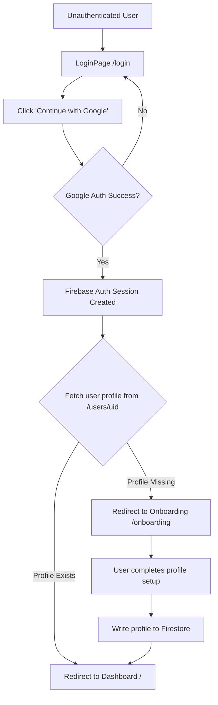

# Authentication & Onboarding Architecture (Google-First)

This document details the architecture for the Google-first authentication and onboarding flow. It eliminates standard email/password registration in favor of Google OAuth, followed by a mandatory onboarding step to collect Ahmedabad University profile details.

## Flow Diagram



## Routing States and Guards

The routes are protected by three custom guards:

1. **`PublicRoute`**: Accessible only when the user is logged out (e.g., `/login`). If logged in, redirects to `/`.
2. **`ProtectedRoute`**: Accessible when the user is logged in *and* has a complete profile in Firestore.
   * If logged out -> `/login`
   * If logged in but profile is null -> `/onboarding`
3. **`OnboardingRoute`**: Accessible when the user is logged in (used for `/onboarding` and `/profile`).
   * If logged out -> `/login`
   * If logged in and has a complete profile, accessing `/onboarding` redirects to `/profile`.

### Routes Map

| Path | Guard | Target Page |
| :--- | :--- | :--- |
| `/login` | `PublicRoute` | `LoginPage` (Only Google Auth button) |
| `/onboarding` | `OnboardingRoute` | `OnboardingPage` (Profile setup form) |
| `/profile` | `OnboardingRoute` | `ProfilePage` (Profile details & edit, feedback, logout) |
| `/` | `ProtectedRoute` | `DashboardPage` |
| `/*` (Admin, etc) | `ProtectedRoute` | Respective protected pages |

## Firestore Schema (`users` collection)

When onboarding is complete, a document is created in the `/users/{uid}` collection with the following fields:

```typescript
interface UserProfile {
  uid: string;           // Match Firebase Auth UID
  email: string;         // Pre-filled from Google Auth
  displayName: string;   // Pre-filled but editable
  contact: string;       // User's contact number
  userType: 'Student' | 'Professor or Faculty' | 'Venture Studio Startup' | 'External Visitor';
  isActive: boolean;     // Default: true
  createdAt: Timestamp;
  updatedAt: Timestamp;
  
  // Conditional fields based on userType
  universityId?: string; // Students
  department?: string;   // Students, Faculty
  courseName?: string;   // Students
  facultyAdvisor?: string; // Students
  teamName?: string;     // Students
  teamMembers?: string;  // Students
  
  researchArea?: string; // Faculty
  associatedCourse?: string; // Faculty
  studentsInvolved?: string; // Faculty
  
  startupName?: string;  // Venture Startup
  industryDomain?: string; // Venture Startup
  startupBrief?: string; // Venture Startup
  labTeamMembers?: string; // Venture Startup
  
  organization?: string; // External Visitor
  designation?: string;  // External Visitor
  purposeOfVisit?: string; // External Visitor
  referral?: string;     // External Visitor
  
  safetyAgreementAccepted: boolean; // Must be true
  termsAccepted: boolean;           // Must be true
}
```

## Component Breakdown

1. **`LoginPage.tsx`**:
   * Removed standard email/password login inputs.
   * Prominent "Continue with Google" button as the primary action.
2. **`OnboardingPage.tsx`** (formerly `RegisterPage.tsx`):
   * Serves as the profile setup screen.
   * Reads pre-filled user details (email and name) from `useAuth()`.
   * Displays step-by-step forms based on `userType` to collect profile information.
   * Writes data directly to Firestore on submit and completes authentication.
3. **`ProfilePage.tsx`**:
   * Serves as the user details hub.
   * View Mode: Displays profile photo (Google `photoURL`), name, email, and user-type specific details. Filters out duplicate badges (e.g. Student/Student).
   * Edit Mode: Allows editing profile details (excluding roles, status, and terms/safety agreements).
   * Missing Profile: Authenticated users without a profile document see an onboarding call-to-action that routes to `/onboarding` instead of editable profile controls.
   * Feedback panel: Allows submitting text feedback up to 200 words, rate-limited to 5 minutes between submissions. The cooldown is tracked per user via a `localStorage` key (`tl_feedback_lastSentAt_{uid}`) so one account's submission does not affect another's.
   * Logout button: Explicitly signs out of Firebase Auth and redirects to `/login`.

## Auth Context (AuthContext.tsx)

* Listens for auth state via `onAuthStateChanged` and mirrors the user's `users/{uid}` document into local state with `onSnapshot`.
* **Role override**: The email `patelaryan19407@gmail.com` is hard-coded as `super_admin` regardless of the stored `role` value. This is a bootstrap/dev override so the platform owner always retains admin access; all other users derive their role strictly from their `users/{uid}` document.
* The deprecated `onAuthStateChanged` error callback is not used; auth errors surface through the individual sign-in/sign-out operations instead.

## Firebase Initialization (lib/firebase.ts)

* Initialization fails fast if neither `VITE_FIREBASE_API_KEY` nor `VITE_FIREBASE_API_KEY_B64` is configured.
* Development credential fallbacks are only applied when emulator mode is explicitly enabled (`VITE_USE_EMULATORS=true` in dev); otherwise a missing key throws before `initializeApp`, `getAuth`, or `initializeFirestore` run.
